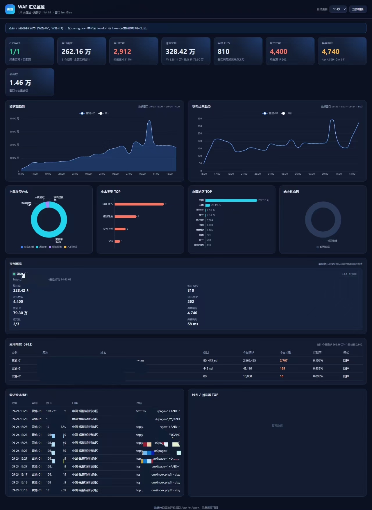

# safelinemonitor 雷池 WAF 汇总监控看板

把多台雷池（SafeLine）WAF 的监控指标拉到同一个页面展示。后端用雷池开放接口定时采集、内存聚合，前端用 ECharts 渲染，零第三方依赖，`node server.js` 即可运行。



## 功能

- **汇总 KPI**：在线实例数、请求总量、实时 QPS、攻击拦截总数、攻击源 IP 数、异常响应（4xx/5xx）、会话数
- **趋势对比**：请求量趋势（按实例堆叠 + 合计线）、攻击拦截趋势（按实例折线 + 合计线）
- **分布 TOP**：拦截类型分布（攻击拦截/黑名单/频率限制/人机验证/认证防护/离线拦截）、攻击类型 TOP、来源地区 TOP、响应状态码分布、域名与浏览器 TOP
- **实例概览**：每台雷池的在线状态、版本与授权、请求量、QPS、拦截数、攻击源 IP、独立 IP、异常响应、应用数、采集耗时
- **应用维度（今日）**：每个应用的今日请求、今日拦截、拦截率、域名/端口与运行模式（数据来自 `/open/site` 的 `req_value` / `denied_value`，与雷池控制台「应用」页一致）；按实例分组展示，避免同名应用串行看错
- **黑名单拦截日志**：合并三台的黑名单命中日志，按时间倒序展示源 IP、归属地、目标域名与 URL、命中规则（如「雷池社区恶意 IP 情报」）与动作；面板右上角同时给出「今日黑名单拦截」总次数
- **频率限制日志**：合并三台的访问限制（限流）命中记录，按时间倒序展示源 IP、归属地、目标应用、命中规则（基础访问限制/基础攻击限制/基础错误限制）、触发阈值（如「100 次 / 10 秒」）、处置方式（人机验证 / 封禁 + 封禁时长）与该次拦截的请求数；面板右上角给出「今日触发」次数
- **最近攻击事件**：合并三台的攻击日志，按时间倒序展示源 IP、归属地、目标域名与 URL、动作、命中规则（含中文规则名）
- **异常可见**：任意实例连不上、鉴权失败或某个指标采集失败时，页面顶部直接提示到具体接口

## 快速开始

环境要求：Node.js 18 或更高版本（无需 `npm install`）。

1. 准备配置：

   ```bash
   cp config.example.json config.json
   ```

2. 在每台雷池控制台获取 API Token：登录控制台后访问 `https://<雷池地址>:9443/swagger`，调用 `GET /open/auth/token` 可直接拿到当前令牌（也可以在控制台的系统设置里重置/查看）。

3. 把三台雷池的地址和 Token 填进 `config.json`。

4. 启动：

   ```bash
   node server.js
   ```

5. 浏览器打开 `http://<部署机IP>:8088`。

## 配置说明

| 字段 | 说明 | 默认值 |
| --- | --- | --- |
| `listen.host` / `listen.port` | 看板监听地址与端口 | `0.0.0.0` / `8088` |
| `range` | 统计时间范围，可选 `today`、`last1Day`、`last7Day`、`last30Day` | `last1Day` |
| `refresh.fastMs` | 高频指标采集间隔（QPS、攻击事件） | `10000` |
| `refresh.slowMs` | 统计类指标采集间隔（趋势、分布、状态码） | `60000` |
| `refresh.metaMs` | 低频指标采集间隔（版本信息、应用列表） | `300000` |
| `refresh.timeoutMs` | 单次请求超时 | `10000` |
| `instances[].name` | 展示名称 | — |
| `instances[].baseUrl` | 雷池控制台地址，如 `https://10.59.125.211:9443` | — |
| `instances[].token` | API Token | — |
| `instances[].allowInsecureTls` | 允许自签名证书（控制台默认自签，保持 `true`） | `true` |
| `instances[].enabled` | 是否采集该实例；留空地址或 Token 会自动跳过 | `true` |

也可以用环境变量 `LEICHI_CONFIG` 指定配置文件路径，便于容器化部署。

## 采集的接口

所有请求都带上 `X-SLCE-API-Token` 请求头，接口前缀为 `/api`。

| 接口 | 用途 |
| --- | --- |
| `GET /open/system` | 版本、授权状态、机器码 |
| `GET /open/site` | 应用列表、应用数量，以及每个应用的今日请求 `req_value` 与今日拦截 `denied_value` |
| `GET /stat/qps?count=12` | 实时 QPS（最近 12 个采样点，每个点是 5 秒窗口内的请求数，需除以 5） |
| `GET /stat/advance/access` | 请求量、PV、独立 IP、会话数 |
| `GET /stat/advance/attack` | 拦截总数、拦截类型细分、攻击源 IP 数 |
| `GET /stat/advance/trend/access` | 请求量趋势 |
| `GET /stat/advance/trend/intercept` | 拦截趋势 |
| `GET /stat/advance/status_code` | 响应状态码分布 |
| `GET /stat/advance/error_status_code` | 4xx / 5xx 统计 |
| `GET /stat/advance/location` | 来源地区 TOP |
| `GET /stat/advance/domain` | 访问域名 TOP |
| `GET /stat/advance/client` | 浏览器 / 操作系统 TOP |
| `GET /open/security_posture/trends?type=attack_type` | 攻击类型 TOP |
| `GET /open/records` | 最近攻击事件 |
| `GET /open/records/rule` | 黑名单/白名单命中日志（看板取 `action=1` 的拦截明细，并用 `start`/`end` 统计今日拦截次数） |
| `GET /open/records/acl` | 频率限制（访问限制）拦截日志，看板用 `begin`/`end` 统计今日触发次数 |

补充一些实测结论，方便二开时少走弯路：

- `/stat/qps` 的每个采样点（按 `time` 排序）是**该 5 秒窗口内收到的请求数**，不是每秒请求数：把 12 个点相加 ≈ 60 秒内 `/open/site` 的 `req_value` 增量。雷池控制台前端也是按 `Math.ceil(value / 5)` 换算成 QPS 的，所以直接拿采样点当 QPS 会把值放大 5 倍。
- 采样点的 `time` 是窗口起始时刻，**最后一个点通常是还没累积完的当前窗口**（经常是 0 或明显偏小），计算实时值时应排除。
- `/stat/advance/domain`、`/stat/advance/client`、`/stat/advance/page`、`/stat/advance/status_code` 属于雷池 Pro（企业版）能力，社区版返回空数组或全 0，看板对应面板会显示「暂无数据」。
- `/open/records`、`/open/events` 的 `start` / `end` 参数单位是**毫秒**，传秒会静默返回 0 条。
- `/open/events` 返回按「攻击源 IP × 应用域名」聚合的事件，字段含 `deny_count`、`pass_count`、`host`，适合做「今日每应用拦截/观察」的精确统计。
- `/stat/qps?site_id=N` 支持按应用拆分（`site_id=0` 是全部应用之和），社区版也能用。
- `/stat/advance/*` 在社区版传 `site_id` 会返回 `{"data":{},"msg":"stat access failed"}`，因为分应用统计是授权功能（前端授权矩阵 `traffic_stats.app_level_stats`，免费版为 `false`）；同理 `time_preset=today` 需要授权。应用维度的今日数据请走 `/open/site`。
- `/open/records/rule` 的 `start` / `end` 同样是**毫秒**时间戳，返回的 `created_at` 是**秒**级时间戳。记录里的 `module` 字段区分 `blacklist`（黑名单）与 `whitelist`（白名单），`action=1` 表示阻断、`action=0` 表示放行；实测传 `module` 参数会被服务端忽略（黑白名单两类返回同样的结果），该接口实际返回的就是被黑名单阻断的记录，看板据此固定取 `action=1`。「今日黑名单拦截」按看板所在主机的本机时区自然日统计，若与雷池控制台时区不一致会有一天边界的偏差。
- `/open/records/acl` 的 `begin` / `end` 单位是**秒**（不是毫秒，传毫秒会返回 0 条），`created_at` / `valid_before` 是带时区的 ISO 字符串（微秒精度，JS `Date.parse` 前会截到毫秒）。除 `page` / `page_size` 外，`ip` 与 `site`（应用 id）过滤也生效；Swagger 里没有列出这些参数，但服务端确实支持。「今日触发」按看板所在主机的本机时区自然日统计。

## 统计口径说明

看板上同时存在两套时间口径，卡片里已用「窗口内」和「应用维度『今日』口径」区分：

| 指标 | 数据来源 | 口径 |
| --- | --- | --- |
| 今日请求 / 今日拦截 / 应用维度表格 | `/open/site` 的 `req_value` / `denied_value` | 每台雷池自己的「今日」（自然日）累计，等于雷池控制台「应用」页 |
| 请求总量、PV、独立 IP、会话数、攻击拦截、攻击源 IP、异常响应、趋势与各分布图 | `/stat/advance/*` | 雷池默认统计窗口（约最近 24 小时），页头会显示窗口起止时间 |
| 实时 QPS | `/stat/qps` | 各实例最近 3 个「已走完」的 5 秒窗口均值 ÷ 5 后求和的每秒请求数 |
| 黑名单拦截日志 / 今日黑名单拦截 | `/open/records/rule`（`action=1`） | 明细为最近 20 条命中记录；次数按本机时区「今日 00:00 至今」过滤后的 `total` 求和 |
| 频率限制日志 / 今日频率限制 | `/open/records/acl`（`begin`/`end`） | 明细为最近 20 条访问限制记录（含封禁时长与解除时间）；次数按本机时区「今日 00:00 至今」过滤后的 `total` 求和，一条记录代表一个源 IP 的一次触发 |

另外两点需要注意：

- 独立 IP、会话数、攻击源 IP 是**各实例数值之和**，同一 IP / 会话打多台实例时会重复计数，跨实例去重需要额外的 IP 明细数据。
- 同名应用在不同实例上的今日拦截可能相差数倍（拦截是分节点独立判定的），应用维度表格请按「实例分组」行逐台核对，不要跨实例比同一行的数值。

## 部署

systemd（Linux）：

```ini
[Unit]
Description=Leichi WAF Monitor
After=network.target

[Service]
WorkingDirectory=/opt/leichimonitor
ExecStart=/usr/bin/node server.js
Restart=always
RestartSec=5

[Install]
WantedBy=multi-user.target
```

Docker：

```bash
docker compose up -d --build
```

`config.json` 通过卷挂载进容器，改完配置重启容器即可。

## 常见问题

- **页面提示「鉴权失败(401)」**：`token` 填写有误，或在雷池控制台重置过令牌，需要同步更新。
- **页面提示「请求超时」/连不上**：确认部署机到雷池 `9443` 端口的网络连通性；雷池控制台默认使用自签名证书，保持 `allowInsecureTls: true`。
- **社区版时间范围不生效**：未授权版本的统计接口只返回默认窗口（约最近 24 小时），设置 `range` 为 `today`/`last7Day`/`last30Day` 会返回 `license required`。此时看板按雷池实际返回的数据窗口展示，页头会显示窗口起止时间。
- **为什么不能直接用浏览器跨域调用**：雷池控制台接口不带跨域响应头，且令牌不应暴露在前端，因此统一由本项目后端代理采集。
- **接口压力**：默认 3 台实例，高频指标（QPS、攻击事件、黑名单/频率限制日志）10 秒一次、统计类 60 秒一次，单实例稳态约 0.6 QPS 的请求量，可放心长期运行；如需更低的采集频率，调大 `refresh` 中的数值即可。

## 项目结构

```
server.js             HTTP 服务：静态页面 + /api/summary、/api/refresh、/api/health
src/config.js         配置加载与校验
src/httpclient.js     零依赖 HTTP 客户端（支持自签名证书、超时）
src/leichi.js         雷池开放接口客户端
src/labels.js         攻击类型、检测模块、拦截类型的中文名称
src/collector.js      定时采集、缓存、多实例聚合
public/index.html     看板页面
public/app.js         页面渲染与图表
public/styles.css     样式
public/vendor/        ECharts（本地化，无需外网）
docs/leichi-swagger.json  雷池控制台离线 Swagger 定义（接口参考）
docs/dashboard-preview.png 看板预览截图
```
